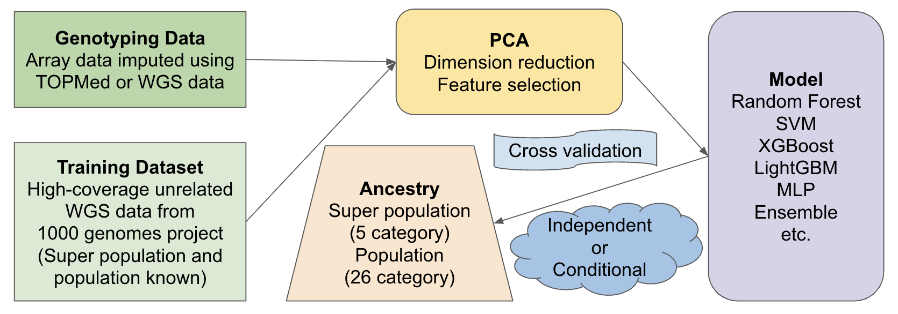

<p align="left">

</p>

# Genetic Ancestry Prediction (GAP)

## Overview

GAP is a Python package, developed at the [Translational Genomics Lab](https://med.stanford.edu/genomics-of-diabetes.html) lead by Dr. Anna Gloyn at Stanford University, for predicting genetic ancestry from genotyping data using machine learning techniques. It provides tools for data preprocessing, model training, and evaluation to facilitate accurate ancestry inference. It shows superior performance compared to existing methods in ADMIXTURE and KING package when benchmarking against self-reported races from [The Human Pancreas Analysis Program](https://hpap.pmacs.upenn.edu/). [HLA imputation](https://github.com/HaniceSun/hla6) conditioned on the predicted genetic ancestry shows improved accuracy when scoring against gold-standard HLA typing data. GAP has been utilized in [Integrated Islet Distribution Program](https://iidp.coh.org/) to report genetic ancestry in addition to genetic risk scores of type 1 and type 2 diabetes.

## Pipeline


## Installation

- using conda

```
git clone git@github.com:HaniceSun/gap.git
cd gap
conda env create -f environment.yml
conda activate gap
```

# Quick Start

```
input_vcf='INPUT.vcf.gz'

gap get-reference-data --output_dir=data (only needed the first time)

gap merge-dataset-with-reference --dataset $input_vcf
gap feature-engineering

gap add-labels
gap split-train-test --input data/features_labeled_Population.txt --test_size 0.2
gap split-train-test --input data/features_labeled_Superpopulation.txt --test_size 0.2

# for the prediction of Superpopulation with 5 categories (AFR, AMR, EAS, EUR, SAS)
config=config.yaml
train=data/features_labeled_Superpopulation_train.txt
test=data/features_labeled_Superpopulation_test.txt
label=data/features_labels_Superpopulation.txt
pred=data/features_ToPred.txt
metrics=data/metrics_Superpopulation.txt
model=model_Superpopulation.pkl
predicted=Predicted_Superpopulation.txt
gap train-model --config_file=$config --train_file=$train --test_file=$test --metrics_file=$metrics
gap eval-model --config_file=$config --train_file=$train --test_file=$test --metrics_file=$metrics --model_file=$model
gap predict --input=$pred --output=$predicted --label_file=$label --metrics_file=$metrics --model_file=$model

# for the prediction of Population with 26 categories (e.g. GBR, CHB, MXL, YRI, etc.)
config=config.yaml
train=data/features_labeled_Population_train.txt
test=data/features_labeled_Population_test.txt
label=data/features_labels_Population.txt
pred=data/features_ToPred.txt
metrics=data/metrics_Population.txt
model=model_Population.pkl
predicted=Predicted_Population.txt
gap train-model --config_file=$config --train_file=$train --test_file=$test --metrics_file=$metrics
gap eval-model --config_file=$config --train_file=$train --test_file=$test --metrics_file=$metrics --model_file=$model
gap predict --input=$pred --output=$predicted --label_file=$label --metrics_file=$metrics --model_file=$model
```

## Citation

If you use GAP in your research, please cite the DOI: [10.5281/zenodo.18157870](https://doi.org/10.5281/zenodo.18157870)

## Author and License

**Author:** Han Sun

**Email:** hansun@stanford.edu

**License:** [MIT License](LICENSE)
