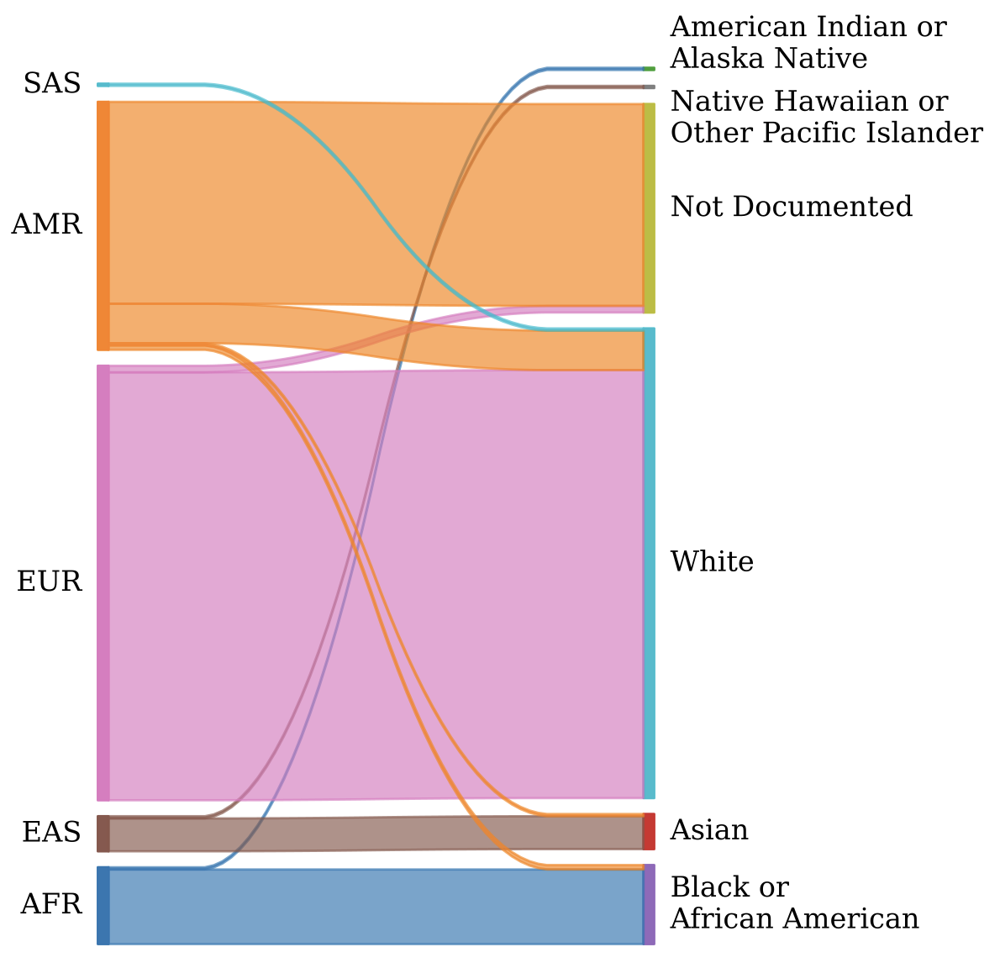

<p align="left">

</p>

# Genetic Ancestry Prediction (GAP)

## Overview

GAP is a Python package, developed at the [Translational Genomics Lab](https://med.stanford.edu/genomics-of-diabetes.html) lead by Dr. Anna Gloyn at Stanford University, for predicting genetic ancestry from genotyping data using machine learning techniques. It provides tools for data preprocessing, model training, and evaluation to facilitate accurate ancestry inference. It shows superior performance compared to existing methods in ADMIXTURE and KING package when benchmarking against self-reported races from [Integrated Islet Distribution Program (IIDP)](https://iidp.coh.org/) and [The Human Pancreas Analysis Program (HPAP)](https://hpap.pmacs.upenn.edu/). GAP has been supported by both IIDP and the Stanford [Accelerate Innovation in Diabetes LeVeraging Unique PAthways iN Asians (ADVANCE)](https://asianhealth.stanford.edu/advance) Program.

## Pipeline


## Installation

- using conda

```
git clone git@github.com:HaniceSun/gap.git
cd gap
conda env create -f environment.yml
conda activate gap
```

# Quick Start

```
input_vcf='INPUT.vcf.gz'

gap get-reference-data --output_dir=data (only needed the first time)

gap merge-dataset-with-reference --dataset $input_vcf
gap feature-engineering

gap add-labels
gap split-train-test --test_size 0.2

gap train-model --task Superpopulation
gap train-model --task Population --conditional true

gap eval-model --task Superpopulation
gap eval-model --task Population --conditional true

gap predict --task Superpopulation
gap predict --task Population --conditional true

gap summarize --conditional true

```

# Benchmark Results

- Superpopulation Prediction vs Self-reported Race in the IIDP cohorts



## Citation

If you use GAP in your research, please cite the DOI: [10.5281/zenodo.18157870](https://doi.org/10.5281/zenodo.18157870)

## Author and License

**Author:** Han Sun

**Email:** hansun@stanford.edu

**License:** [MIT License](LICENSE)
